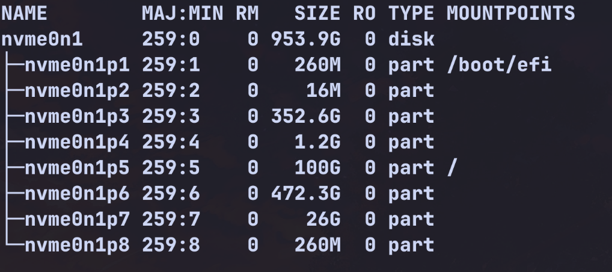

+++
date =2025-07-04
draft = false
categories = ['General']
tags = ['Linux', 'Operating System']
title = 'Arch Linux Installation'
description = 'Arch Linux 安装指南，适合新手'
+++

# Arch Linux Installation

## 前言

本文档主要内容源自 [Arch Linux Wiki](https://wiki.archlinux.org/) 和 [Arch Linux Installation Guide](https://wiki.archlinuxcn.org/wiki/%E5%AE%89%E8%A3%85%E6%8C%87%E5%8D%97)，并经过了个人的整理和扩展，旨在为新手提供一个清晰的安装流程。本教程默认读者的电脑均为 UEFI 模式引导。下面正式开始教程。

## 准备工作

### 制作启动盘

1. 获取镜像文件。下面是在中国的镜像站，挑选一个就行，均可以公网访问。
   - [清华大学开源软件镜像站](https://mirrors.tuna.tsinghua.edu.cn/archlinux/iso/latest/)
   - [中科大开源软件镜像站](https://mirrors.ustc.edu.cn/archlinux/iso/latest/)
   - [阿里云开源软件镜像站](https://mirrors.aliyun.com/archlinux/iso/latest/)
   - [华为云开源软件镜像站](https://mirrors.huaweicloud.com/archlinux/iso/latest/)
   - [南科大开源软件镜像站](https://mirrors.sustech.edu.cn/archlinux/iso/latest/)
2. 制作启动盘 (win 环境)
   选用 [Rufus](https://rufus.ie/) 制作启动盘。下载之后，选择已经下载好的镜像文件，保持默认选项即可，点击 _"开始"_ , 选择 _DD 模式_ ，就会开始烧录 。
   **注意**：制作启动盘会清空 U 盘上的所有数据，请提前备份。

### 磁盘分区

读者的电脑初始应该是自带 windows 系统的，可以在 windows 上为 Arch Linux 预留一个分区（假如你想使用双系统的话）。

- 按下 Win + X 键，然后选择“磁盘管理”。
- 在磁盘管理中，找到你想要分区的磁盘，右键点击该磁盘，选择“压缩卷”。
- 系统会计算可压缩的空间。在“输入要压缩的空间量”处，输入你希望为 Arch Linux 准备的空间大小。例如，如果你想给 Arch 留出 100GB，就输入 102400 。
- 点击“压缩”后，你会看到磁盘图表中出现了一块黑色的“未分配”空间。
- 这一部分就可以作为 Arch Linux 的安装分区。

## 正式安装

### 启动到 live 环境

- 进入 bios 设置 ，将安全启动关闭，否则会启动失败
- 进入 bios 设置，将启动顺序调整为 USB 启动优先
- 保存设置并重启电脑，选择 _Arch Linux install medium_ 进入 live 环境

### 验证引导模式

```bash
cat /sys/firmware/efi/fw_platform_size
```

- 如果命令结果为 64，则系统是以 UEFI 模式引导且使用 64 位 x64 UEFI。

### 连接网络 （Wifi）

- 进入 iwd 命令行界面，输入:

```
iwctl
```

- 查看网络设备名称

```
device list
```

- 假设网络设备名称为 _wlan0_，输入以下命令扫描可用的 Wi-Fi 网络：

```
station wlan0 scan
```

- 查看可用的 Wi-Fi 网络列表：

```
station wlan0 get-networks
```

- 连接到 Wi-Fi 网络，假设网络名称为 _MyNetwork_：

```
station wlan0 connect MyNetwork
```

然后密码会提示输入，输入密码后按回车。

- 连接好后，就可以返回：

```
exit
```

- 验证网络连接是否成功：

```
ping -c 3 archlinux.org
```

如果能看到类似 `64 bytes from ...` 的输出，说明网络连接成功。

**注意**: 如果 wifi 名称携带中文，由于命令行无法输入中文，所以无法直接连接，可以通过 wifi 名称的 UTF-8 编码来连接。

### 更新系统时间

使用 [timedatectl(1)](https://man.archlinux.org/man/timedatectl.1) 确保系统时间是同步的：

```bash
timedatectl
```

### 磁盘分区

输入

```
fdisk -l (此处为小写字母l)
```

你将会看到类似这样的输出：


其中你可以看到 nvme0n1 是你的硬盘设备名称，nvme0n1p1 是你的第一个分区和你的 windows 系统中的 CD 盘和你已经分好的 Arch linux 分区。

假设你操作的硬盘是 /dev/nvme0n1 ，你可以使用以下命令操作硬盘：

```
fdisk /dev/nvme0n1
```

输入 p 查看现有分区，确认 Windows 的分区都在。

- 输入 n 开始创建新分区（它会自动在未分配空间中开始）。
- 创建根 / 分区:
  - 输入 _n_，回车
  - 分区号、起始扇区按回车
  - Last sector, 直接回车 (使用所有剩余空间)
- 保存与推出
  - 输入 _p_ 检查分区表是否正确，有无误删 windows 分区
  - 仔细确认没有误删 Windows 的分区后，输入 w 保存退出。

假设新创建的分区是/dev/nvme0n1p5 (根)。
进行如下操作:

```bash

# 格式化根分区为 ext4
mkfs.ext4 /dev/nvme0n1p5

# 挂载根分区
mount /dev/nvme0n1p5 /mnt


# 挂载 Windows 的 EFI 分区 , Arch linux与 Windows 共用 EFI 分区
# 假设 EFI 分区是 /dev/nvme0n1p1
mkdir -p /mnt/boot
mount /dev/nvme0n1p1 /mnt/boot  # 注意：是 p1，并且不要格式化它！
```

### 安装基本系统

- 更改镜像源

```bash
vim /etc/pacman.d/mirrorlist
```

在文件顶部添加以下内容，在下面选择一个离你最近的镜像站点：

```ini
Server = https://mirrors.tuna.tsinghua.edu.cn/archlinux/$repo/os/$arch # 清华大学镜像站
Server = https://mirrors.ustc.edu.cn/archlinux/$repo/os/$arch # 中国科学技术大学镜像站
Server = https://mirrors.aliyun.com/archlinux/$repo/os/$arch # 阿里云镜像站
Server = https://mirrors.huaweicloud.com/archlinux/$repo/os/$arch # 华为云
Server = https://mirrors.sustech.edu.cn/archlinux/$repo/os/$arch # 南方科技大学镜像站
```

- 安装必须的软件包
  
```bash
pacstrap -K /mnt base linux linux-firmware vim nano networkmanager
# 如果是 intel CPU，可以安装 intel-ucode
pacstrap -K intel-ucode
# 如果是 AMD CPU，可以安装 amd-ucode
pacstrap -K amd-ucode
```

- 配置系统
```bash
genfstab -U /mnt >> /mnt/etc/fstab
arch-chroot /mnt
```
- 设置密码
```bash
passwd
```

- 安装引导程序
```bash
pacman -S grub efibootmgr os-prober
grub-install --target=x86_64-efi --efi-directory=/boot --bootloader-id=GRUB
grub-mkconfig -o /boot/grub/grub.cfg
```
双系统下需要启用 os-prober
```bash
sudo vim /etc/default/grub
```
找到下面这一行并修改为  
```bash
GRUB_DISABLE_OS_PROBER=false
```
然后重新生成 grub 配置文件
```bash
grub-mkconfig -o /boot/grub/grub.cfg
```

- 收尾
```bash
exit
umount -R /mnt
reboot
```

## 安装后的工作 KDE+Wayland

当你重启之后，从 grub 菜单中选择 Arch Linux 进入系统。
你会看到一个命令行界面，这时候你需要安装图形界面。
这时候需要你用 root 用户登录，用户名是 root，密码是你刚才设置的密码。

- 启用 NetworkManager 服务

```bash
systemctl enable NetworkManager.service
systemctl start NetworkManager.service
```
现在你的网络应该已经连接好了。
如果没有连接好，可以使用 nmcli 命令行工具连接网络。
```bash
nmcli device wifi list # 列出可用的 wifi 网络
nmcli device wifi connect <wifiname> password <password> # 连接 Wifi
ping -c 3 archlinux.org # 测试网络是否连接成功
```

- 创建 swap file
  swap 文件可以帮助系统在内存不足时使用硬盘空间作为虚拟内存。同时，swap 文件也可以在系统休眠时保存内存内容。这个 swap 文件的大小至少是你的内存大小，要稍大一些。

```bash
# fallocate 命令可以快速创建一个指定大小的文件
fallocate -l 16G /swapfile
# 设置 swap 文件的权限
chmod 600 /swapfile
# 将文件格式化为 swap
mkswap /swapfile
# 启用 swap 文件
swapon /swapfile
# 将 swapfile 的条目追加到 fstab 文件末尾
echo '/swapfile none swap defaults 0 0' >> /etc/fstab
```

- 创建非特权账户

```bash
useradd -m -G wheel <username> # 替换 <username> 为你的用户名
passwd your_username # 输入密码
```

安装基础的编辑器 vim / nano

```bash
sudo pacman -S vim nano
```

安装 sudo 同时编辑 sudoers 文件

```bash
pacman -S sudo
vim /etc/sudoers # :wq! 强制退出
```

在打开的文件中，找到下面这一行并取消注释（删除行首的 #）：

```bash
%wheel ALL=(ALL:ALL) ALL
```

然后就可以输入 _exit_ 退出 root 用户，使用新创建的用户登录了。

- 安装图形界面 KDE Plasma

```bash
sudo pacman -S plasma plasma-wayland-session # 安装 KDE Plasma 和 Wayland 会话
sudo pacman -S kde-applications-meta # KDE 全家桶
sudo pacman -S sddm # 安装 SDDM 显示管理器
sudo systemctl enable sddm.service
sudo pacman -S mesa # 安装 Mesa 图形驱动
sudo pacman -S nvidia nvidia-utils nvidia-settings # 如果你的电脑是 NVIDIA 显卡
```

然后就可以重启电脑，进入 KDE Plasma 桌面环境了。

### 将界面设置为中文

在 KDE 桌面环境中，打开系统设置，找到“区域设置”，将语言设置为中文（简体中文），并将区域设置为中国。这样就可以将界面语言设置为中文了。如果出现乱码，可以尝试安装以下字体：

```bash
sudo pacman -S noto-fonts-cjk noto-fonts-emoji wqy-zenhei
```

此时还有一部分软件还是英文，可以进入 /etc/locale.gen 修改

```bash
sudo vim /etc/locale.gen
```

找到以下行并取消注释：

```ini
#en_US.UTF-8 UTF-8
#zh_CN.UTF-8 UTF-8
#zh_SG.UTF-8 UTF-8
#zh_TW.UTF-8 UTF-8
```

然后运行以下命令生成语言包：

```bash
sudo locale-gen
```

最后设置系统级默认区域

```bash
echo "LANG=zh_CN.UTF-8" | sudo tee /etc/locale.conf
```

Log out 或重启系统，界面就会变成中文了。

### 配置 archlinuxcn multilib

```bash
sudo vim /etc/pacman.conf # 打开 pacman 配置文件
```

在文件末尾添加以下内容：

```ini
[archlinuxcn]
Server = https://mirrors.tuna.tsinghua.edu.cn/archlinuxcn/$arch #换成你选择的镜像站
```

找到这两行取消注释

```ini
#[multilib]
#Include = /etc/pacman.d/mirrorlist
```

然后保存退出。
接下来更新系统并安装 archlinuxcn 的密钥：

```bash
sudo pacman -Syu # 更新系统
sudo pacman -S archlinuxcn-keyring # 安装 archlinuxcn 的密钥
sudo pacman -Syu # 再次更新系统
```

### 安装包助手 paru

```bash
sudo pacman -S --needed base-devel
git clone https://aur.archlinux.org/paru.git
cd paru
makepkg -si
rm -rf paru
```

### 安装常用软件

```bash
paru -S firefox # Firefox 浏览器
paru -S google-chrome # Chromium 浏览器
paru -S visual-studio-code-bin # Visual Studio Code
paru -S fcitx5 fcitx5-configtool # Fcitx5 输入法
paru -S fcitx5-chinese-addons # Fcitx5 中文输入法
paru -S fcitx5-pinyin-zhwiki # Fcitx5 中文词库
paru -S fcitx5-gtk fcitx5-qt # Fcitx
```

为了让系统和应用能调用输入法，需要设置环境变量。编辑/etc/environment 文件。
在文件中加入以下三行：
```bash
GTK_IM_MODULE=fcitx
QT_IM_MODULE=fcitx
XMODIFIERS=@im=fcitx
```
对于 fcitx5 如果要启用中文输入法，可以在设置中找到 “输入法” > “添加输入法”，然后选择“拼音”。而要启用 Fcitx5 输入法框架，可以将其添加到 KDE 的自动启动项中：
- 打开系统设置，导航到“启动和关闭” > “自动启动”。
- 点击“添加程序”，然后输入 `fcitx5`，点击“确定”
- 重启系统，Fcitx5 应该会自动启动。
  
## 软件列表（自用）
- **浏览器**: Google Chrome (AUR)
- **编辑器**: Visual-Studio-Code(AUR) , Neovim
- **终端**: WezTerm
- **输入法**: Fcitx5
- **通讯** : linuxqq, WeChat, Telegram
- **vpn**: clash-verge
- **编辑**: wps-office
- **Shell** : zsh && fish
- **文件管理**: Dolphin
