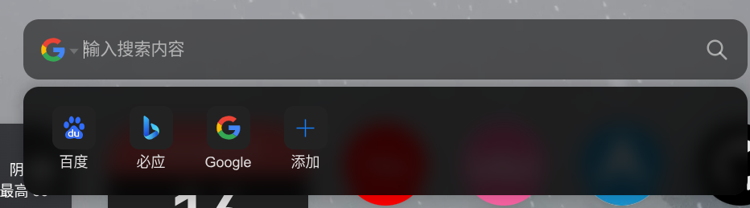

+++
date =2025-08-03
draft = false
categories = ['General','Computer Science']
tags = []
title = 'The Missing CS Knowledge'
description = '本教程将为你推荐一些计算机科学领域的重要知识点，帮助你提升专业素养。'
+++

# 前言

本文是《你所缺失的那门计算机的课》的浓缩和自己理解的补充，旨在帮助读者填补在计算机科学领域的知识空白。

- 修改浏览器
- 软件寻找+工具类软件
- 软件基本维护
- 键盘快捷键

## 浏览器

工欲善其事，必先利其器。浏览器的选择很大程度上影响了你的上网体验和本文后面的部分。结论：国产浏览器诸如 360,QQ,百度，如果还在你的电脑尚存在，建议立即卸载。
尽量使用我说的下面三个浏览器：

1. [Google Chrome](https://www.google.com/chrome/)
2. [Mozilla Firefox](https://www.mozilla.org/firefox/)
3. [Microsoft Edge](https://www.microsoft.com/edge)
   这三个等都有丰富插件，而且三个搜索出来的结果都能搜到正规的资源，而非 "Steam 游戏中心"/"xx 软件园" 。

如果你懂访问外国网络，我建议你优先选择[Google Chrome](https://www.google.com/chrome/)。反之，我会推荐[Firefox](https://www.mozilla.org/firefox/) 。
如果你嫌弃麻烦，可以选择[Microsoft Edge](https://www.microsoft.com/edge)，这个浏览器电脑自带，开箱即用。

### 插件推荐

这三个浏览器都有丰富插件，大大提升你的浏览体验。

此时在浏览器初始页面右上角中有 三个点/三条线 的图标，点击后在一串列表中可以找到 “扩展程序” 之类的字样，你就可以找到插件市场。

- [iTab](https://chrome.google.com/webstore/detail/itab/),为你的浏览器提供更好的标签管理体验。
- [uBlock Origin](https://github.com/gorhill/uBlock) - 一款强大的广告拦截插件，帮助你屏蔽烦人的广告和追踪器。
- [Fireshot](https://getfireshot.com/) - 一款强大的网页截图工具，支持全页截图和编辑。
- [Smallpdf](https://smallpdf.com/) - 一款在线 PDF 工具，提供 PDF 压缩、合并、转换等功能。

另外，当你下载了 iTab 插件后，你可以在左侧更换搜索引擎，使用更符合自己需求的搜索工具(别换回百度了，不然前功尽弃)。

## 软件寻找

我们想下载一个软件，通常会去搜索引擎上输入软件名称，然后点击第一个链接下载。这个过程看似简单，但实际上有很多陷阱和误区。

### 首选：官方渠道

比如你要下载　[Visual Studio Code](https://code.visualstudio.com/)，建议直接访问其官方网站进行下载。这种如果你更换了搜索引擎，一般会在前列的得到正确的搜索结果而非广告。

### 其次：知名软件仓库

如果你无法通过官方渠道找到软件，或者需要寻找一些冷门软件，可以考虑以下知名软件仓库：

- [GitHub](https://github.com/) - 全球最大的开源软件开发平台，许多优秀的软件项目都托管在这里,你可以在项目仓库的主页面找到 release 字样的连接,那是作者打包好的下载包。
- [SourceForge](https://sourceforge.net/) - 另一个老牌的开源软件开发平台，提供丰富的软件资源。
- [Chocolatey](https://chocolatey.org/) - Windows 平台的软件包管理器，可以方便地安装和管理软件。
- [Microsoft Store](https://www.microsoft.com/store) - Windows 系统自带的应用商店，提供各种应用和游戏的下载。

这些软件仓库通常会提供软件的最新版本和详细信息，帮助你做出更好的选择。

### 绝对杜绝

xx 软件园,不知名的下载市场,这种东西遭遇捆绑下载和恶意软件的风险极高,一定要避免。

## 软件管理

### 更改下载位置

- 如果你不会分 C/D 盘,请看这个[视频](https://www.bilibili.com/video/BV1Qs4y1E7UL/?share_source=copy_web&vd_source=6748be86751d9c233ae8e6d6a6c5a45f):

更改软件安装位置
一般来说，软件安装完成后再移动位置会非常困难，因此最好在安装前就选择合适的安装路径。

具体操作步骤：

1. 找到安装路径选项：
   当软件安装向导出现时，通常会显示默认安装位置，如 C:\Program Files\软件名称 或 C:\Users\用户名\AppData\Local\软件名称

2. 更改安装路径：
   点击"浏览"或"更改"按钮
   在 D 盘新建一个专门的文件夹（如 D:\Software\软件名称）
   选择该文件夹作为新的安装位置
3. 确认更改：确保路径正确后继续安装，这样软件就会安装到 D 盘指定位置

Tips：

建议在 D 盘创建统一的软件安装目录，便于管理
避免使用中文路径，可能导致某些软件运行异常
记住安装路径，方便后续卸载或备份

### 软件更新

一般来说,一家大公司的软件会自动推送更新,而比如从 GitHub 上下载的软件则需要手动进行更新,就是从官网下载最新版本进行再一次安装,然后替换。

### 软件卸载

软件卸载绝不是删除一个快捷方式那么简单。正确的卸载方式应该是通过系统自带的卸载工具或者软件自带的卸载程序进行卸载，以确保软件的所有组件都被彻底清除。

我推荐 [Geek Uninstaller](https://geekuninstaller.com/) 这款软件，它可以帮助你彻底卸载软件，并清理残留的文件和注册表信息。

## 软件推荐

在日常工作和学习中，我们常常需要寻找各种软件来提高效率。以下是一些推荐的软件和工具，帮助你更好地完成任务。

### 笔记类

- [Notion](https://www.notion.so/) - 一款集笔记、任务管理和知识库于一体的工具，适合个人和团队使用。
- [Obsidian](https://obsidian.md/) - 一款强大的知识管理工具，支持 Markdown 语法和双向链接。
- [Typora](https://typora.io/) - 一款简洁优雅的 Markdown 编辑器，支持实时预览和多种导出格式。

### 编程类

- [Visual Studio Code](https://code.visualstudio.com/) - 一款强大的代码编辑器，支持多种编程语言和丰富的插件生态。
- [Sublime Text](https://www.sublimetext.com/) - 一款轻量级的代码编辑器，界面简洁，支持多种编程语言。
- [JetBrains 系列](https://www.jetbrains.com/) - 一系列强大的 IDE，支持多种编程语言，适合专业开发者使用。

### office 类

- [Microsoft Office](https://www.microsoft.com/office) - 一款强大的办公软件套件，包括 Word、Excel、PowerPoint 等，适合各种文档处理需求,但是要激活才可以享受全部功能,在购买电脑的时候会有赠送,如果没有,可以上学校官网下载正版,这里放一个 [哈神功](https://ms-hitsz-edu-cn.hitsz.edu.cn/) (校园网/VPN 访问)。
- [WPS Office](https://www.wps.com/) - 一款轻量级的办公软件，提供文档、表格、演示等功能，兼容 Microsoft Office 格式。
- [Google Docs](https://docs.google.com/) - 一款在线文档编辑工具，支持多人协作和实时编辑。

### 压缩类

- [7-Zip](https://www.7-zip.org/) - 一款开源的文件压缩和解压缩工具，支持多种压缩格式。
- [WinRAR](https://www.rarlab.com/) - 一款强大的文件压缩和解压缩工具，界面友好，功能强大。
- [Bandizip](https://www.bandizip.com/) - 一款轻量级的文件压缩和解压缩工具，支持多种压缩格式。

### 影音类

- [VLC Media Player](https://www.videolan.org/vlc/) - 一款开源的媒体播放器，支持几乎所有音频和视频格式。
- [PotPlayer](https://potplayer.daum.net/) - 一款功能强大的媒体播放器，界面简洁，支持多种格式。

### 文件类

- [Everything](https://www.voidtools.com/) - 一款快速的文件搜索工具，可以帮助你快速找到电脑上的文件。
- [Total Commander](https://www.ghisler.com/) - 一款强大的文件管理器，支持双窗口和多种文件操作。
- [FreeCommander](https://freecommander.com/) - 一款免费的文件管理器，界面友好，功能强大。

### 安全类

这方面不需要太多,Windows 系统自带的杀毒软件已经够用,可以用火绒拦截一些奇怪的弹窗广告

- [火绒安全软件](https://www.huorong.cn/) - 一款国产的安全防护软件，提供全面的病毒查杀和系统优化功能。

这些工具可以帮助你提高工作效率，减少不必要的时间浪费。

## 寻找优质教程

在学习计算机科学的过程中，找到优质的教程和学习资源至关重要。以下是一些寻找优质教程的建议：

1. **官方文档**：许多编程语言和框架都有官方文档，通常是学习的最佳起点。例如，[Python 官方文档](https://docs.python.org/3/) 和 [JavaScript MDN 文档](https://developer.mozilla.org/zh-CN/docs/Web/JavaScript)。
2. **两大视频平台**：YouTube (需要魔法) 和 Bilibili 上有许多优质的计算机科学和编程教程，可以通过搜索相关关键词找到适合自己的视频。
3. **交流网站** : 首推 GitHub 和 Stack Overflow，这两个平台上有大量的开源项目和技术问答，可以帮助你解决具体问题。其次是 Csdn 和 博客园 和 知乎,不过由于国内环境的糜烂,属于是石里淘金。
4. **技术博客**：许多开发者和技术专家会在个人博客上分享他们的知识和经验，关注一些知名的技术博客可以获取到很多实用的教程和技巧,比如 [我的 blog](https://capoo-fan.github.io/) (无耻推荐)。

## AI 类

平时解决问题可以借助 AI 工具，比如使用 ChatGPT 来获取编程帮助、文档查询等。现在来说国外 AI 远胜于 国内 AI ,但是国外 AI 需要梯子访问。

### 常用 AI 工具

- 国外 AI
  - [ChatGPT](https://chat.openai.com/) - 一款强大的对话式 AI 工具，可以帮助你解决各种问题,要钱且需要梯子访问。
  - [Gemini](https://gemini.google.com/) - Google 推出的对话式 AI 工具，支持多种语言,香港以及大陆无法访问,2.5 flash 免费使用。
- 国内 AI
  - [Deepseek](https://deepseek.cn/) - 国内较强的 AI,但是幻觉严重,体现为写论文的时候瞎编论据。
  - [kimi](https://kimi.ai/) - 一款国内的对话式 AI 工具，主要是可以免费生成 PPT。
  - [豆包](https://www.doubao.ai/) - 一款国内的对话式 AI 工具，可以免费生成图片。

最后推荐一个网址 [AI 工具大全](https://ai-bot.cn/?)。

## 键盘快捷键

掌握常用的键盘快捷键可以大大提高你的工作效率。以下是一些常用软件的快捷键汇总：

- Ctrl + C：复制
- Ctrl + V：粘贴
- Ctrl + Z：撤销
- Ctrl + S：保存
- Ctrl + F：查找
- Ctrl + A：全选
- Ctrl + P：打印
- Ctrl + N：新建窗口
- Ctrl + Shift + N：新建隐身窗口
- Win + R + 输入 "cmd"：打开命令提示符
- Win + R + 输入 "powershell"：打开 PowerShell

掌握这些快捷键后，你会发现自己的工作效率有了显著提升。
