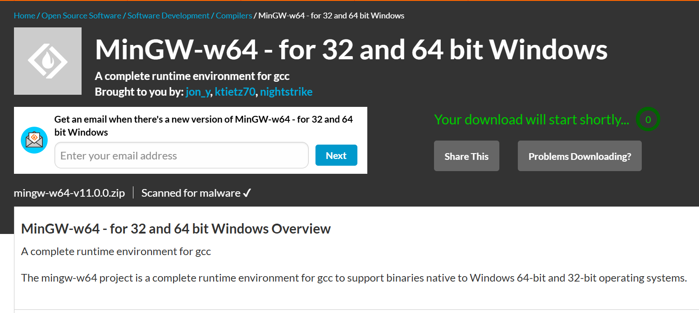

+++
date =2025-08-03
draft = false
categories = ['General','Vscode']
tags = ['C/Cpp']
title = 'Vscode配置教程'
description = '本教程将引导你从零开始，在 Windows 系统上为 VS Code 配置基于 MinGW-w64 的 C/C++ 编译、运行及调试环境'
+++

# Vscode 配置教程

## 下载 vscode 

[vscode官方网址](https://code.visualstudio.com/Download)

 建议勾选全部选项，这会为你后续的开发提供极大的便利，例如直接在文件或文件夹上右键通过 Code 打开。” 

## 插件安装

点击 VS Code 侧边活动栏中的‘扩展’图标（通常是四个方块堆叠的形状），在打开的搜索框中搜索以下插件名并安装。。

- Chinese (Simplified) (简体中文) ： 中文汉化
- Tokyo Night ：主题插件
- C/C++ Compile Run: 方便快速编译运行单文件
- C/C++: 核心支持，提供代码高亮、智能感知等
- Better C++ Syntax: 提供更精准的 C++ 语法高亮
- Error Lens: 在代码行内直接显示错误和警告信息，非常直观。
- Material Icon Theme: 提供更美观的图标主题

## 配置编译运行调试环境

### mingw-w64下载

[下载网址](https://sourceforge.net/projects/mingw-w64/files/Toolchains%20targetting%20Win64/Personal%20Builds/mingw-builds/8.1.0/threads-posix/seh/)

在下载页面中，请找到 x86_64-8.1.0-release-posix-seh-rt_v6-rev0.7z 的链接点击进行下载 。


如果下载速度过慢，可以点击页面的 "problem downloading?" 链接，选择不同的链接来更换下载源，速度会有不同。

### 配置环境变量

1. 解压文件：使用解压软件（如 7-Zip 或 windows自带的解压软件）将下载的 x86_64-8.1.0-release-posix-seh-rt_v6-rev0.7z 文件解压。
2. 放置文件夹：解压后会得到一个名为 mingw64 的文件夹。将这个 mingw64 文件夹移动到一个不含中文或空格的稳定地址下，例如 C:\ 或 D:\。
3. 复制地址：进入这个 bin 文件夹，并复制bin文件夹的完整地址。在 Windows 文件资源管理器的地址栏单击或者对着 bin文件夹 右键复制文件地址，即可获得该地址。

- 在 Windows 搜索框中搜索 “环境变量”，然后选择 “编辑系统环境变量”。

- 在弹出的 “系统属性” 窗口中，点击 “环境变量(N)...” 按钮。

- 在下方的 “系统变量(S)” 区域，找到并双击名为 Path 的变量。

- 在 “编辑环境变量” 窗口中，点击 “新建”，然后将你复制的编译器地址 (例如:"C:\Users\ *你的用户名* \x86_64-8.1.0-release-posix-seh-rt_v6-rev0\mingw64\bin") 粘贴进去。

- 一路点击 “确定” 保存所有设置。

- 'Win+R' 打开运行窗口，输入 `cmd` 并回车，在输入框输入 `g++ --version` 检查是否安装成功。（Win 键就是键盘左下的由四个方格组成的键）
- 
- 如果有如下版本信息，则表示安装成功（无需全部对应）。
  
```bash
g++ (x86_64-posix-seh, Built by MinGW-W64 project) 8.1.0
Copyright (C) 2018 Free Software Foundation, Inc.
This is free software; see the source for copying conditions.  There is NO
warranty; not even for MERCHANTABILITY or FITNESS FOR A PARTICULAR PURPOSE.
```

### 编译与调试

新建一个 'test' 文件夹,注意要在C/D盘创建，不要在桌面创建（原因后面会讲到），其中新建hello.cpp,粘贴以下代码作为测试

```cpp
#include <iostream>
using namespace std;
int main() 
{
    int a=1;
    cout<<a<<" hello,world";
    return 0;
}
```

然后在 test 文件夹下新建一个 ".vscode" 文件夹
新建 "tasks.json"
粘贴以下代码:
```json
{
  "version": "2.0.0",
  "tasks": [
    {
      "label": "C/C++: g++.exe build active file",
      "type": "cppbuild",
      // 关键：必须替换成你自己的 g++.exe 的完整地址！
      // 示例：C:\\Users\\ABCD\\x86_64-8.1.0-release-posix-seh-rt_v6-rev0\\mingw64\\bin\\g++.exe
      "command": " 你的g++.exe的完整地址 ", //g++.exe在mingw64/bin目录下,同样的办法右键复制地址即可，复制文件地址过来是单斜杠会报错。自行按照示例改成双斜杠即可
      "args": [
        "-fdiagnostics-color=always",
        "-g", // 生成调试信息
        "${file}",
        "-o",
        "${fileDirname}\\${fileBasenameNoExtension}.exe"
      ],
      "options": {
        "cwd": "${fileDirname}"
      },
      "problemMatcher": ["$msCompile"],
      "group": {
        "kind": "build",
        "isDefault": true // 设置为默认构建任务 (Ctrl+Shift+B)
      },
      "detail": "compiler: 你的g++.exe的完整地址  ", //与上同理
    }
  ]
}

```

----

然后依旧在.vscode文件夹下新建 launch.json

```json
{
  "version": "0.2.0",
  "configurations": [
    {
      "name": "(gdb) Launch C++ Debug",
      "type": "cppdbg",
      "request": "launch",
      "program": "${fileDirname}\\${fileBasenameNoExtension}.exe",
      "args": [],
      "stopAtEntry": false,
      "cwd": "${fileDirname}",
      "environment": [],
      "externalConsole": true, // 推荐true，程序会运行在独立的cmd窗口，输入输出更方便
      "MIMode": "gdb",
      // 关键：必须替换成你自己的 gdb.exe 的完整地址！
      "miDebuggerPath": "你的gdb.exe完整地址",// gdb.exe在mingw64/bin目录下,同样的办法右键复制地址即可
      "setupCommands": [
        {
          "description": "Enable pretty-printing for gdb",
          "text": "-enable-pretty-printing",
          "ignoreFailures": true
        },
        {
          "description": "Set Disassembly Flavor to Intel",
          "text": "-gdb-set disassembly-flavor intel",
          "ignoreFailures": true
        }
      ],
      // 关键：在启动调试前，自动执行 tasks.json 中定义的构建任务
      "preLaunchTask": "C/C++: g++.exe build active file"
    }
  ]
}
```

**编译**
按下 `F6` 键，或者点击左侧栏的运行按钮，选择 "C/C++: g++.exe build active file"，这会编译当前打开的文件如果一切正常，你会看到输出 `1 hello,world`。

**调试**
将鼠标移动到 第 5 行 int a=1; 的行号左侧，光标会变成一个小红点，单击鼠标左键，设置一个断点。
然后按下 `F5` 键，或者点击左侧栏的运行按钮，选择 "C++ (GDB) Launch"，程序会在独立的命令行窗口中运行。并且程序会在断点处暂停。

## 问题排查

在环境变量导入正确的情况下，一般来说编译是不会有问题的。如果调试有问题，系统会提示你找不到 'launch.json' 文件,此时要检查你的文件地址是否携带中文，比如 'hello.cpp' 和 创建的各种 .json 文件，对每一个文件复制一下文件地址然后找到一个地方粘贴即可查看是否有中文。例如你把 test 文件夹放在了桌面就会出问题。


## 尾记

有人说 vscode 的 C/C++ 开发环境配置太麻烦了，为什么不直接用其他 IDE？其实我也试过其他的 IDE，像 Code::Blocks、Dev-C++ 等等，但总觉得不如 vscode 灵活。vscode 的插件生态非常丰富，而且界面简洁，操作流畅，适合各种开发需求。总吃开箱即用的"方便面"总是对身体不好的，自己花点时间配置一个适合自己的环境，既可以了解一些计算机的知识，又可以得到一个舒适的开发环境，何乐而不为。

