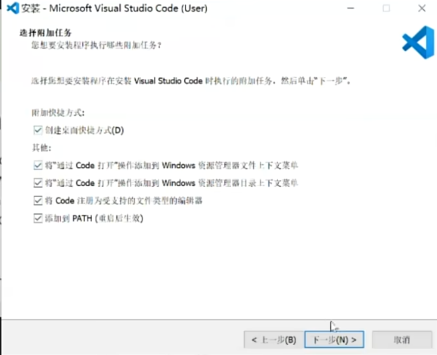

+++
date =2025-08-03
draft = false
categories = ['General','Vscode']
tags = ['Vscode','C/Cpp']
title = 'Vscode配置教程'
description = '配置在Vscode的C/Cpp运行环境'
+++

# Vscode 配置教程

## 下载 vscode 

[vscode官方网址](https://code.visualstudio.com/Download)

 注意这里建议全部勾选，以后会方便很多。

## 插件安装

在左边栏的方块中就是插件市场，直接搜索下载就可以。

- Chinese (Simplified) (简体中文) 
- Tokyo Night
- C/C++ Compile Run
- C/C++
- Better C++ Syntax
- Error Lens

## 配置编译运行调试环境

### mingw-w64下载

[下载网址](https://sourceforge.net/projects/mingw-w64/)

